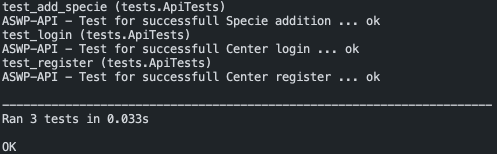

# ASWP-API 
Flask REST API for Animals Sales Web Project

# Project setup
Instructions on how to start the API

## Python
To start this project you need ```python>=3.9```

## Virtual environment
Create and activate virtual environment for the project
```sh
virtualenv your_virtual_env_name
source your_virtual_env_name/bin/activate
```

## Requirements
Install project requirements from ```requirements.txt``` file using ```pip```
```sh
pip3 install -r requirements.txt 
```

## Testing
Test if code is working properly in your new environment

```sh
cd api
python3 -m unittest -v tests.py
```

Successful testing result example



## Starting API
Start API with default Flask server
```sh
cd api
export FLASK_APP=main.py
flask run
```

# API routes and usage examples
Here you can find list of routes and usage examples with Python 3 and ```requests``` library for this API 

## List

| Method 	|          Route          	|                Description               	|
|:------:	|:------------------------	|:----------------------------------------:	|
|   GET  	| ```/login```            	|               Get JWT token              	|
|   GET  	| ```/animals```          	|         Get full list of animals         	|
|   GET  	| ```/animals/<int:id>``` 	| Get detailed information about an animal 	|
|   GET  	| ```/centers```          	|         Get full list of centers         	|
|   GET  	| ```/centers/<int:id>``` 	| Get detailed information about an center 	|
|   GET  	| ```/species```          	|         Get full list of species         	|
|   GET  	| ```/species/<int:id>``` 	| Get detailed information about an specie 	|
|  POST  	| ```/register```         	|            Register new center           	|
|  POST  	| ```/animals```          	|             Create new animal            	|
|  POST  	| ```/species```          	|             Create new specie            	|
|   PUT  	| ```/animals/<int:id>``` 	|               Update animal              	|
| DELETE 	| ```/animals/<int:id>``` 	|               Delete animal              	|

## Examples
### GET Requests

#### Center login
```python
import requests

url = "http://127.0.0.1:5000/login"

payload="{\n    \"login\": \"login\",\n    \"password\": \"password\"\n}"
headers = {
  'Content-Type': 'application/json'
}

response = requests.request("GET", url, headers=headers, data=payload)

print(response.text)

```

#### Full list of animals
```python
import requests

url = "http://127.0.0.1:5000/animals/"

payload={}
headers = {
  'Content-Type': 'application/json'
}

response = requests.request("GET", url, headers=headers, data=payload)

print(response.text)

```

#### Animal by ID
```python
import requests

url = "http://127.0.0.1:5000/animals/1"

payload={}
headers = {
  'Content-Type': 'application/json'
}

response = requests.request("GET", url, headers=headers, data=payload)

print(response.text)

```

#### Specie by ID
```python
import requests

url = "http://127.0.0.1:5000/species/1"

payload={}
headers = {
  'Content-Type': 'application/json'
}

response = requests.request("GET", url, headers=headers, data=payload)

print(response.text)

```

#### Full list of centers
```python
import requests

url = "http://127.0.0.1:5000/centers"

payload={}
headers = {
  'Content-Type': 'application/json'
}

response = requests.request("GET", url, headers=headers, data=payload)

print(response.text)

```

#### Center by ID
```python
import requests

url = "http://127.0.0.1:5000/centers/1"

payload={}
headers = {
  'Content-Type': 'application/json'
}

response = requests.request("GET", url, headers=headers, data=payload)

print(response.text)

```

#### Full list of species
```python
import requests

url = "http://127.0.0.1:5000/species"

payload={}
headers = {
  'Content-Type': 'application/json'
}

response = requests.request("GET", url, headers=headers, data=payload)

print(response.text)

```

### POST Requests

#### Center register
```python
import requests

url = "http://127.0.0.1:5000/register"

payload="{\n    \"login\": \"login\",\n    \"password\":\"password\",\n    \"name\": \"John Doe\",\n    \"address\": \"Address\"\n}"
headers = {
  'Content-Type': 'application/json'
}

response = requests.request("POST", url, headers=headers, data=payload)

print(response.text)

```

#### Add animal
```python
import requests

url = "http://127.0.0.1:5000/animals/"

payload="{\n    \"name\": \"Animal\",\n    \"specie\": 1,\n    \"age\": 5,\n    \"price\": 500.50\n}"
headers = {
  'Content-Type': 'application/json',
  'Authorization': 'Bearer <JWT>'
}

response = requests.request("POST", url, headers=headers, data=payload)

print(response.text)

```

#### Add specie
```python
import requests

url = "http://127.0.0.1:5000/species"

payload="{\n    \"name\": \"Specie name\",\n    \"price\": 123,\n    \"description\": \"Specie description\"\n}"
headers = {
  'Content-Type': 'application/json',
  'Authorization': 'Bearer <JWT>'
}

response = requests.request("POST", url, headers=headers, data=payload)

print(response.text)

```

### PUT Requests
#### Update animal
```python
import requests

url = "http://127.0.0.1:5000/animals/1"

payload="{\n    \"name\": \"Updated animal\"\n}"
headers = {
  'Content-Type': 'application/json',
  'Authorization': 'Bearer <JWT>'
}

response = requests.request("PUT", url, headers=headers, data=payload)

print(response.text)

```
### DELETE Requests
#### Delete animal
```python
import requests

url = "http://127.0.0.1:5000/animals/1"

payload={}
headers = {
  'Content-Type': 'application/json',
  'Authorization': 'Bearer <JWT>'
}

response = requests.request("DELETE", url, headers=headers, data=payload)

print(response.text)

```